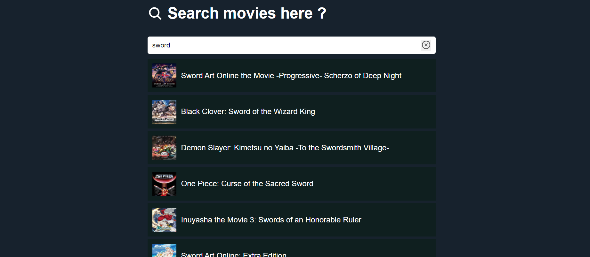

# React + Vite

This is a normal search input component which will fetch data from TMDB API and based on the user input it will show the related movies.

- Debouncing is implemented to improve the performance.

- Some images of the project

